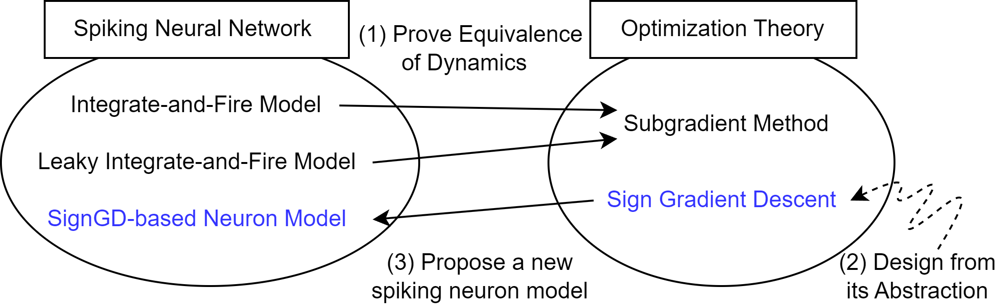
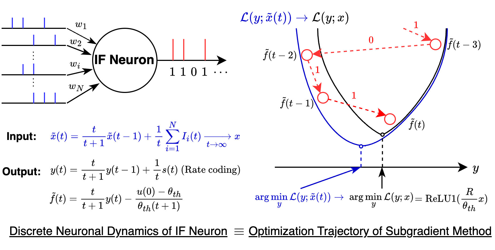

# Sign Gradient Descent-based Neuronal Dynamics: ANN-to-SNN Conversion Beyond ReLU Network

[](https://opensource.org/licenses/MIT)


<!-- Placeholder for teaser image -->
<p align="center">
  
</p>
<p align="center">
  
</p>

This repository contains the code for our ICML 2024 paper:

**"[Sign Gradient Descent-based Neuronal Dynamics: ANN-to-SNN Conversion Beyond ReLU Network](https://arxiv.org/abs/2407.01645)"**

## Introduction

Spiking neural network (SNN) is studied in multidisciplinary domains to (i) enable order-of-magnitudes energy-efficient AI inference and (ii) computationally simulate neuro-scientific mechanisms. The lack of discrete theory obstructs the practical application of SNN by limiting its performance and nonlinearity support. We present a new optimization-theoretic perspective of the discrete dynamics of spiking neurons. We prove that a discrete dynamical system of simple integrate-and-fire models approximates the sub-gradient method over unconstrained optimization problems. We practically extend our theory to introduce a novel sign gradient descent (signGD)-based neuronal dynamics that can (i) approximate diverse nonlinearities beyond ReLU and (ii) advance ANN-to-SNN conversion performance in low time steps. Experiments on large-scale datasets show that our technique achieves (i) state-of-the-art performance in ANN-to-SNN conversion and (ii) is the first to convert new DNN architectures, e.g., ConvNext, MLP-Mixer, and ResMLP.

## Table of Contents

- [Prerequisites](#prerequisites)
- [Installation](#installation)
  - [Using VSCode Dev Containers](#using-vscode-dev-containers)
  - [Manual Installation](#manual-installation)
- [Usage](#usage)
- [Project Structure](#project-structure) 
- [License](#license)
- [Contact](#contact)
- [Citation](#citation)
- [Acknowledgements](#acknowledgements)

## Prerequisites

- **Python Version**: The code requires **Python 3.10**.
- **PyTorch**: Version **2.0.1** with CUDA support.
- **Operating System**: Linux or Windows with CUDA-compatible GPU.

## Installation

### Using VSCode Dev Containers

If you have the Dev Containers extension installed in VSCode:

1. **Open the Command Palette**:
   - Press <kbd>Ctrl</kbd>+<kbd>Shift</kbd>+<kbd>P</kbd> (or <kbd>Cmd</kbd>+<kbd>Shift</kbd>+<kbd>P</kbd> on macOS).

2. **Select**:
   - **"Dev Containers: Rebuild and Reopen in Container"**.

3. **Wait for Setup**:
   - VSCode will rebuild and reopen the project in a containerized environment with all dependencies installed.

### Manual Installation

If you are not using VSCode:

1. **Install Python 3.10**:
   - Download and install Python 3.10 from the [official website](https://www.python.org/downloads/release/python-3100/).

2. **Install PyTorch 2.0.1 with CUDA**:
   - Visit [PyTorch's official website](https://pytorch.org/get-started/previous-versions/) and select the appropriate command for your system.
   - Example installation command:
     ```bash
     pip install torch==2.0.1+cu117 torchvision==0.15.1+cu117 --extra-index-url https://download.pytorch.org/whl/cu117
     ```

3. **Clone the Repository**:
   ```bash
   git clone https://github.com/snuhcs/snn_signgd
   cd snn_signgd
   ```

4. **Install Required Packages**:
   ```bash
   pip install setuptools
   pip install -e .
   ```

## Usage

We provide a minimal example to demonstrate how to use the code.

1. **Navigate to the `examples` Directory**:
   ```bash
   cd examples
   ```

2. **Run the Minimal Example Script**:
   ```bash
   python minimal_example.py
   ```
   This script showcases the basic usage of our signGD-based neuronal dynamics for ANN-to-SNN conversion.

## Project Structure

The repository is organized as follows:

```
.
├── data/
├── docs/
├── examples/
├── experiments/
├── src/packages/
│   └── snn_signgd/
├── tests/
├── .devcontainer/
├── LICENSE
├── README.md
├── requirements.txt
├── setup.py
```

### Description of Directories

- **data/**: Stores datasets used in the project, such as CIFAR10. This directory includes necessary initialization scripts and data preparation tools.

- **docs/**: Contains documentation resources, including images and presentation slides that illustrate the concepts and results of the project.

- **examples/**: Provides example usage scripts for the package. This includes minimal examples to get started and scripts demonstrating how to apply the package to specific datasets like CIFAR10.

- **experiments/**: Houses experimental configurations, logs, resources, scripts, and source code for running experiments.

  - **config/**: Configuration files for datasets, models, neuronal dynamics, and optimizers.

    - **datasets_and_models/**: Configuration files for various datasets (e.g., CIFAR10, CIFAR100, ImageNet) and models.

    - **neuronal_dynamics/**: Configurations for different neuronal dynamics implementations, such as sign gradient descent and subgradient methods.

    - **optimizers/**: Configuration files for different optimizers like Adam, SGD, and their variants.

  - **logs/**: Stores log files generated during experiments.

  - **resources/**: Contains resources like checkpoints and pretrained models.

  - **samples/**: Placeholder directory for sample outputs or data generated during experiments.

  - **scripts/**: Includes scripts for training and evaluating models.

    - **train.py**: Script to train models using specified configurations.

    - **evaluate.py**: Script to evaluate trained models on test datasets.

  - **src/**: Source code specific to experiments, including datasets, models, and tasks.

    - **dataset/**: Contains dataset loaders and preprocessing scripts.

    - **model/**: Includes model definitions and architectures used in experiments.

    - **task/**: Defines tasks for downstream applications like image classification.

- **src/**: Contains the core code of the package that is installable.

  - **packages/**: The main package directory that includes all installable modules.

    - **snn_signgd/**: Core implementation of the sign gradient descent-based neuronal dynamics.

      - **conversion.py**: Tools for converting ANNs to SNNs using the proposed method.

      - **core/**: Core modules essential for the package functionality.

      - **graph_functional/**: Utilities for graph transformations and pattern matching in neural networks.

      - **neuronal_dynamical_system/**: Implements various neuronal dynamics, including generalizations for different activation functions.

- **tests/**: Contains unit tests to ensure the correctness and reliability of the package. (To be added)

- **.devcontainer/**: Configuration files for setting up a development container in VSCode, including the `Dockerfile` and `devcontainer.json`.

- **LICENSE**: The MIT License under which the project is distributed.

- **README.md**: The main README file providing an overview of the project, installation instructions, usage examples, and other essential information.

- **requirements.txt**: Lists all Python dependencies required to run the project.

- **setup.py**: Installation script that allows the package to be installed via `pip`.

## License

This project is licensed under the MIT License - see the [LICENSE](LICENSE) file for details.

## Contact

For questions or inquiries, please contact:

- **Hyunseok Oh**
- Email: [ohsai@snu.ac.kr](mailto:ohsai@snu.ac.kr)
- Affiliation: Seoul National University

## Citation

If you find this code useful in your research, please cite our paper:

```bibtex
@article{oh2024sign,
  title={Sign Gradient Descent-based Neuronal Dynamics: ANN-to-SNN Conversion Beyond ReLU Network},
  author={Oh, Hyunseok and Lee, Youngki},
  journal={arXiv preprint arXiv:2407.01645},
  year={2024}
}
```

## Acknowledgements

This work was partly supported by the National Research Foundation of Korea (NRF) grant (No. 2022R1A2C3008495) and the Institute of Information & Communications Technology Planning & Evaluation (IITP) grant [NO.2021-0-01343-004, Artificial Intelligence Graduate School Program (Seoul National University)] funded by the Korean government (MSIT).


---

**Note**: 
- We currently provide a minimal example to demonstrate the basic functionality of our method. We will gradually add reproducible evaluation scripts and advanced usage examples to help users replicate the results from our paper and apply our method to different architectures.
- All experiments code should be executed inside the experiments/ directory. This ensures that all configurations, paths, and resources are correctly set up for successful execution.

---